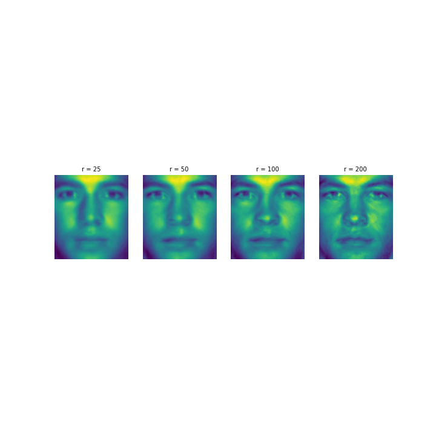
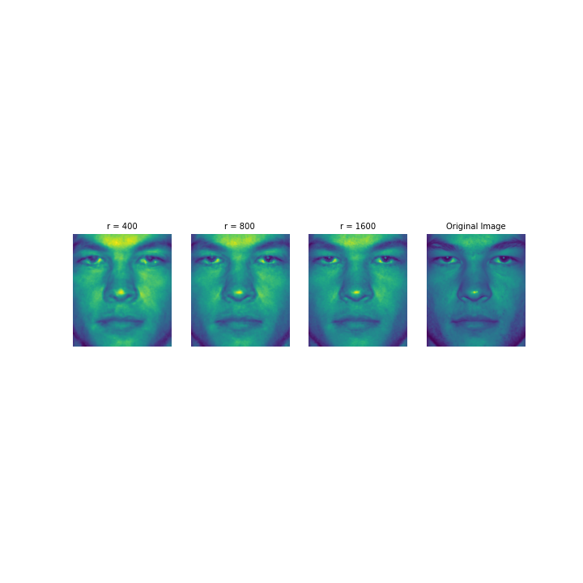
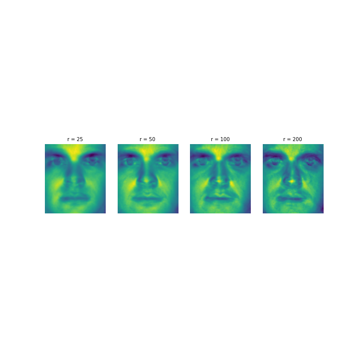

# Eigen Faces and Data compression

Learn how to perform Exploratory Data Analysis for Natural Language Processing using WordCloud in Python.

## Description:

In this we will use a wine review dataset taken from Wine Enthusiast website to learn:

 - How to create a basic wordcloud from one to several text documents
 - Adjust color, size and number of text inside your wordcloud
 - Mask your wordcloud into any shape of your choice
 - Mask your wordcloud into any color pattern of your choice

  

  
   

  
   

## Dataset Content:

Here, we demonstrate this algorithm using the Extended Yale Face Database, consisting of cropped and aligned images of 38 individuals under 9 poses and 64 lighting conditions.

#### Dataset Link: http://www.databookuw.com/

## Prerequisites:

Below libraries are needed to execute this Python code.

 - numpy
 - matplotlib
 - os
 - PIL
 - scipy.io
