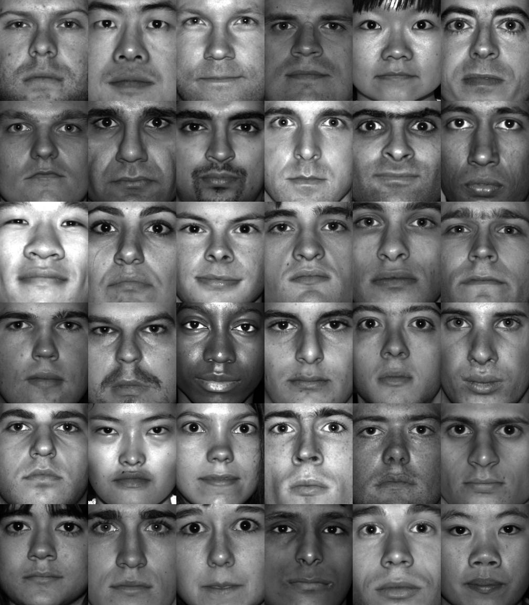
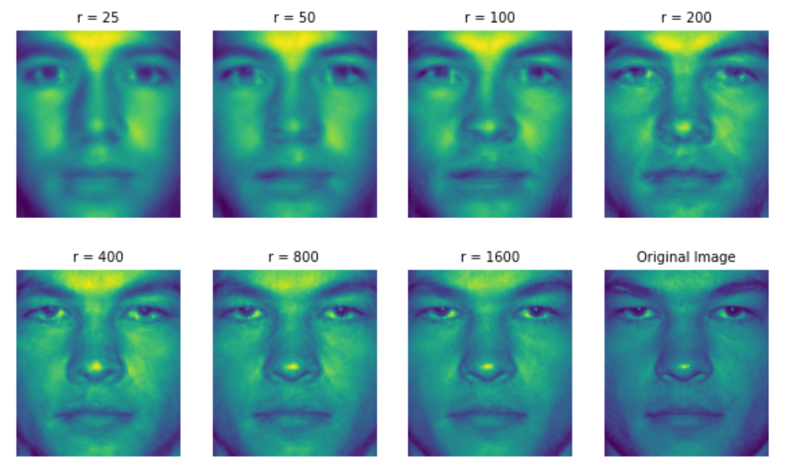

# Eigen Faces and Data compression

Learn how to perform Exploratory Data Analysis for Natural Language Processing using WordCloud in Python.

## Description:

In this project we will use Extended Yale Face Database to construct a data compression algorithm using Eigen faces. Steps include:
 - Create a large readable matrix `allPersons` from the data set with each block assigned to each individual
 - Compute the mean (or average) face out of all them and create `avgFace`
 - Compute Eigen Faces - Eigenvectors using `np.linalg.svd()`
 - Construct a given `testFace` by projecting it to the projection matrix `U[:,:r]*U[:,:r].T`.

  

Below shows the projection of two test faces into the Eigen Face projectoin matrix by selecting different number of Eigen Faces.

  

  

## Dataset Content:

Here, we demonstrate this algorithm using the Extended Yale Face Database, consisting of cropped and aligned images of 38 individuals under 9 poses and 64 lighting conditions.

#### Dataset Link: http://www.databookuw.com/

## Prerequisites:

Below libraries are needed to execute this Python code.

 - numpy
 - matplotlib
 - os
 - PIL
 - scipy.io
